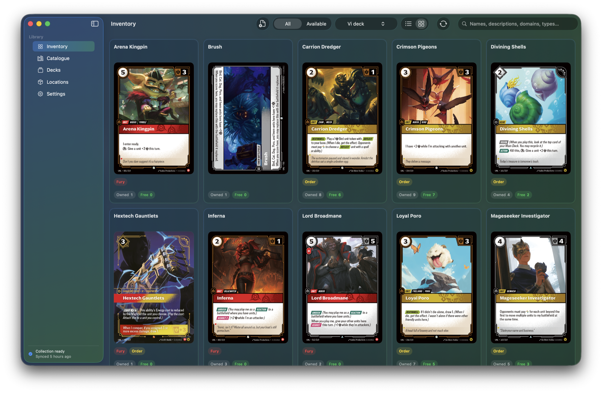
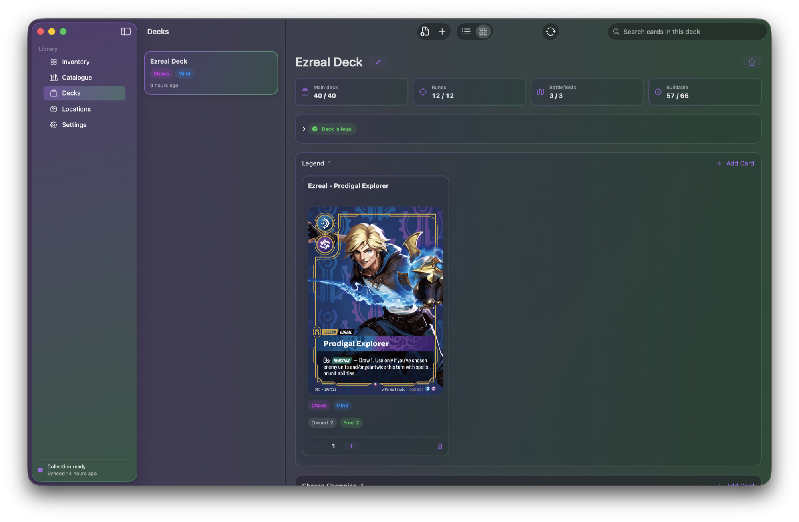
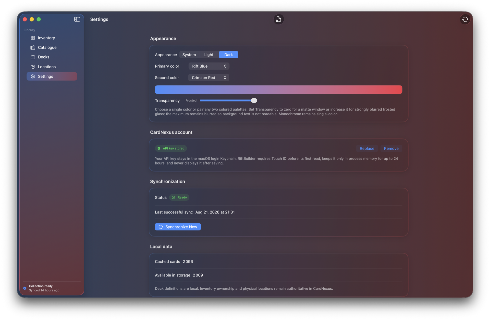

# RiftBuilder

[](https://github.com/Corwind/Riftbuilder/actions/workflows/ci.yml)
[](https://github.com/Corwind/Riftbuilder/actions/workflows/release.yml)

RiftBuilder is a native macOS application for browsing the complete Riftbound catalogue, managing a CardNexus-backed collection, and building decks from the cards that are physically available.



## Highlights

- Synchronizes the Riftbound catalogue, inventory lines, quantities, locations, and location colors from CardNexus.
- Preserves every remote inventory line, then groups copies by card and location for accurate owned and available totals.
- Treats cards in storage boxes as available, cards in assembled deck locations as unavailable to other decks, and locally disabled locations as hidden from the rest of the app.
- Imports RiftDeck text exports, including punctuation variants such as `Ezreal, Prodigy` and `Ezreal - Prodigy`.
- Reports which deck cards are available in storage, already committed to another deck, or missing; basic runes are treated as unlimited.
- Supports deck naming and renaming, legality checks, card-type organization, catalogue search, location filtering, list and grid layouts, and detailed card previews.
- Searches card names, rules text, domains, and types, so queries such as `empower` find cards by ability text.
- Caches catalogue data, inventory data, deck definitions, and card artwork locally for fast navigation and offline browsing.
- Offers light, dark, and system appearances with single-color or dual-color gradient themes and adjustable frosted-glass transparency.

## Deck building

Create a deck manually or import a RiftDeck text export. RiftBuilder resolves each entry against the catalogue, validates the deck, compares its requirements with location-aware availability, and keeps Legend, Champion, Main Deck, Battlefields, Rune Pool, and Sideboard sections distinct.



A local deck definition does not reserve inventory by itself. Physical availability changes only when cards move between CardNexus locations. Explicit assembly and disassembly actions use CardNexus inventory batch updates to move or split the corresponding inventory lines.

## Inventory availability

CardNexus remains authoritative for owned quantities and physical locations. RiftBuilder never flattens distinct remote inventory lines during synchronization.

| Location policy | Available to a new deck? | Behavior |
| --- | --- | --- |
| Storage | Yes | Boxes and other storage locations contribute to free quantities. |
| Deck | No | Cards are committed to the linked assembled deck; that deck may still count its own copies. |
| Unavailable | No | Trade stock, loans, sale inventory, and other excluded locations are hidden elsewhere in the app. |

## Appearance and synchronization

The Settings view controls appearance, theme colors, frosted transparency, CardNexus credentials, synchronization, and local-cache status.



The CardNexus API key is stored in the macOS login Keychain. RiftBuilder requires Touch ID before its first read, retains the credential only in process memory for up to 24 hours, and never displays the saved value again. Inventory writes occur only after an explicit physical move is confirmed.

## Requirements

- macOS 15 or later
- Swift 6.2 or later
- Full Xcode for running the SwiftUI app, executing XCTest, and producing a conventional signed `.app` archive
- A CardNexus API key with exactly `inventory:read` and `inventory:write`

No Apple Account or paid Apple Developer Program membership is required to use RiftBuilder or run a local build. A paid membership is needed only by someone distributing a conventional Developer ID-signed and notarized build or publishing through the Mac App Store.

## Run locally

Open `Package.swift` in Xcode, select the `RiftBuilder` scheme, and run it on **My Mac**.

For a stable command-line app bundle, create the persistent user-scoped local signing identity once, then build and launch RiftBuilder:

```sh
./Scripts/setup-local-signing.sh
./Scripts/run-local-app.sh
```

The local signing identity requires no Apple Account and prevents rebuilds from invalidating the Keychain item’s code-signing trust.

With a full Xcode installation selected, command-line verification uses:

```sh
swift build --disable-sandbox
swift test --disable-sandbox
```

## Releases

Every release starts in [`CHANGELOG.md`](CHANGELOG.md). Add a new top-level release with a SemVer version, date, and bullet list of the main changes; set `CFBundleShortVersionString` in `Support/Info.plist` to the same version and increment `CFBundleVersion`. When that pull request is merged into `main`, GitHub Actions builds the release app, signs it, publishes a downloadable DMG and SHA-256 checksum as workflow artifacts, creates the matching `vMAJOR.MINOR.PATCH` tag, and publishes a GitHub Release using the changelog entry as its notes. The mounted DMG contains RiftBuilder and an Applications shortcut for drag-and-drop installation.

Without Apple credentials, the workflow produces an ad-hoc-signed, unnotarized build. To enable conventional distribution, create a protected GitHub environment named `release` and configure `MACOS_CERTIFICATE_BASE64`, `MACOS_CERTIFICATE_PASSWORD`, `APPLE_ID`, `APPLE_TEAM_ID`, and `APPLE_APP_SPECIFIC_PASSWORD` as environment secrets. The certificate secret must contain a Base64-encoded Developer ID Application `.p12`; GitHub imports it into an ephemeral keychain, signs the app and DMG, submits the DMG to Apple, staples the notarization ticket, and deletes the temporary keychain before publishing.

## Documentation

- [Setup guide](docs/SETUP.md)
- [Architecture decisions](docs/ARCHITECTURE.md)
- [Implementation plan](docs/IMPLEMENTATION_PLAN.md)
